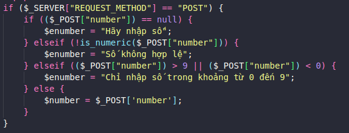
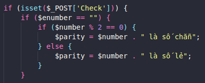
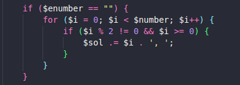
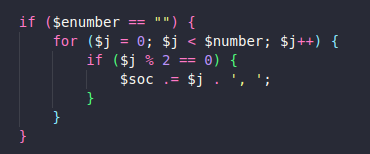
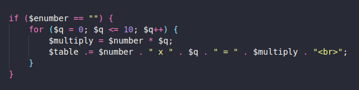
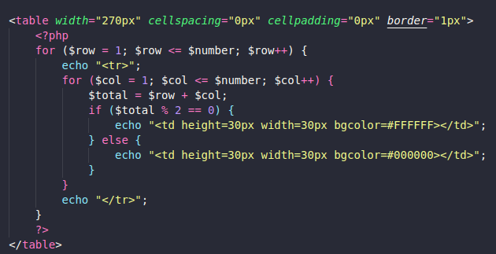

# NUmber

Thực hiện bởi: Nguyễn Tuấn Nguyên

## Trong bài bao gồm:
1. Nhập số
1. Kiểm tra số vừa nhập

    - 

1. Kiểm tra số vừa nhập là chẵn hay lẻ

    - 

1. Tìm các số lẻ nhỏ hơn số vừa nhập

    - 

1. Tìm các số chẵn nhỏ hơn số vừa nhập

    - 

1. Bảng cửu chương của số vừa nhập

    - 

1. Tạo hình tam giác cân có chiều cao bằng số vừa nhập

    - 

1. Tạo hình bàn cờ có kích thước bằng số vừa nhập

    - 
